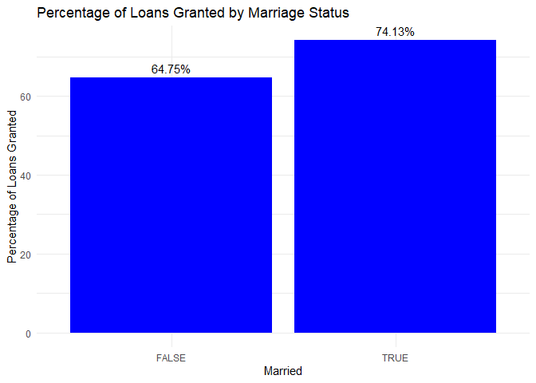
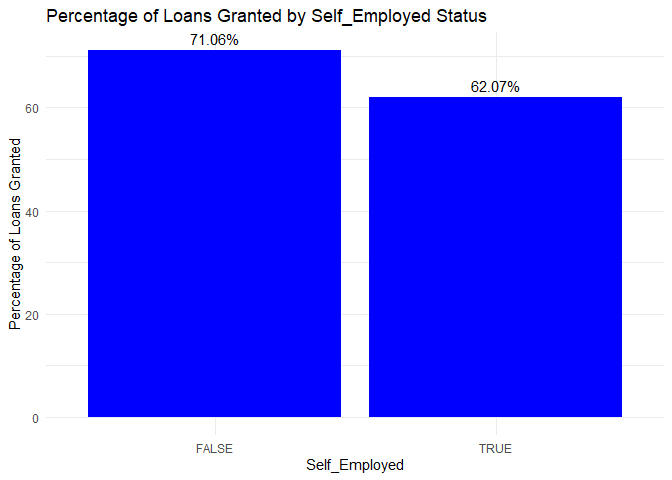
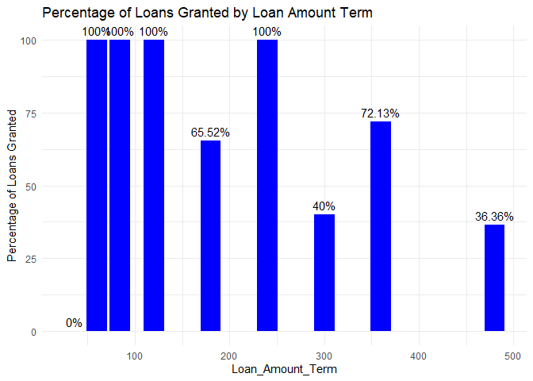
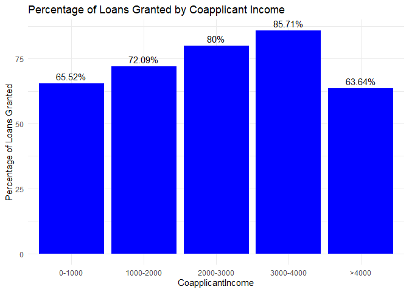
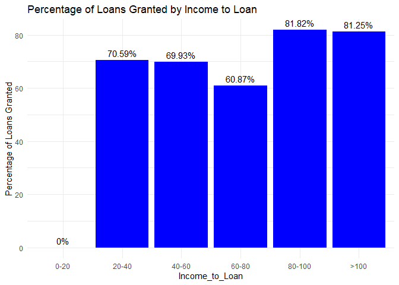
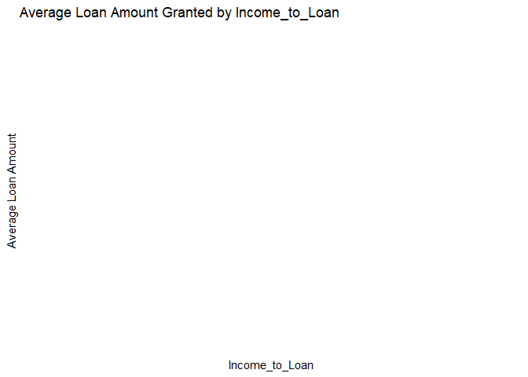
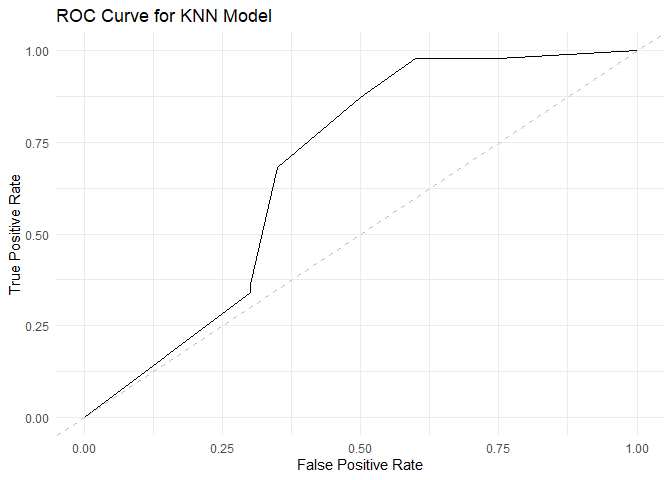

# Load libraries


``` r
library(tidyverse)
```

```
## ── Attaching core tidyverse packages ──────────────────────── tidyverse 2.0.0 ──
## ✔ dplyr     1.1.4     ✔ readr     2.1.5
## ✔ forcats   1.0.0     ✔ stringr   1.5.1
## ✔ ggplot2   3.5.1     ✔ tibble    3.2.1
## ✔ lubridate 1.9.3     ✔ tidyr     1.3.1
## ✔ purrr     1.0.2     
## ── Conflicts ────────────────────────────────────────── tidyverse_conflicts() ──
## ✖ dplyr::filter() masks stats::filter()
## ✖ dplyr::lag()    masks stats::lag()
## ℹ Use the conflicted package (<http://conflicted.r-lib.org/>) to force all conflicts to become errors
```

``` r
library(caret)
```

```
## Lade nötiges Paket: lattice
## 
## Attache Paket: 'caret'
## 
## Das folgende Objekt ist maskiert 'package:purrr':
## 
##     lift
```

``` r
library(randomForest)
```

```
## randomForest 4.7-1.1
## Type rfNews() to see new features/changes/bug fixes.
## 
## Attache Paket: 'randomForest'
## 
## Das folgende Objekt ist maskiert 'package:dplyr':
## 
##     combine
## 
## Das folgende Objekt ist maskiert 'package:ggplot2':
## 
##     margin
```

``` r
library(e1071)
library(pROC)
```

```
## Type 'citation("pROC")' for a citation.
## 
## Attache Paket: 'pROC'
## 
## Die folgenden Objekte sind maskiert von 'package:stats':
## 
##     cov, smooth, var
```

``` r
library(rpart)
library(ggplot2)
```

# Load & Transform the data


``` r
# Load the data
rawData <- read.csv("loan_data.csv")

# Transform the data
rawData <- rawData %>%
  select(-Loan_ID) %>%
  mutate(Married = Married == "Yes",
         Education = Education == "Graduate",
         Self_Employed = Self_Employed == "Yes",
         Gender = as.factor(Gender),
         Dependents = as.factor(Dependents),
         Property_Area = as.factor(Property_Area),
         Loan_Status = as.factor(Loan_Status == "Y"))
```

# Feature Engineering


``` r
rawData <- rawData %>%
  mutate(Total_Income = ApplicantIncome + CoapplicantIncome,
         Income_to_Loan = Total_Income / LoanAmount)

# Drop all missing values just for testing TODO
rawData <- drop_na(rawData)

# Check for null values and handle them (if any)
null_counts <- colSums(is.na(rawData))
print(null_counts)
```

```
##            Gender           Married        Dependents         Education 
##                 0                 0                 0                 0 
##     Self_Employed   ApplicantIncome CoapplicantIncome        LoanAmount 
##                 0                 0                 0                 0 
##  Loan_Amount_Term    Credit_History     Property_Area       Loan_Status 
##                 0                 0                 0                 0 
##      Total_Income    Income_to_Loan 
##                 0                 0
```


``` r
# Save the data as a csv #TODO
write.csv(rawData, "C:/Users/timst/Documents/GitHub/E-Business-Loan-Status-Prediction/rawData.csv")
```

# Initial Data sighting


``` r
# Plot 1: Distribution of Loan Status with customized colors
ggplot(rawData, aes(x = Loan_Status, fill = Loan_Status)) +
  geom_bar() +
  scale_fill_manual(values = c("TRUE" = "#90EE90", "FALSE" = "#FFB6C1")) +
  ggtitle("Distribution of Loan Status") +
  theme_minimal()
```

<!-- -->

``` r
# Plot 2: Distribution of Gender with customized RGB colors
ggplot(rawData, aes(x = Gender, fill = Gender)) +
  geom_bar() +
  scale_fill_manual(values = c("Male" = "#89CFF0", "Female" = "#FFB6C1")) +
  ggtitle("Distribution of Gender") +
  theme_minimal()
```

<!-- -->

``` r
# Plot 3: Average Loan Amount by Property Area
avg_loan_amount <- rawData %>%
  group_by(Property_Area) %>%
  summarize(LoanAmount = mean(LoanAmount))

ggplot(avg_loan_amount, aes(x = Property_Area, y = LoanAmount)) +
  geom_bar(stat = "identity") +
  ggtitle("Average Loan Amount by Property Area") +
  ylab("Average Loan Amount") +
  theme_minimal()
```

<!-- -->

``` r
# Plot 4: Distribution of Loan Status by Education
ggplot(rawData, aes(x = Loan_Status, fill = Education)) +
  geom_bar(position = "dodge") +
  ggtitle("Distribution of Loan Status by Education") +
  theme_minimal()
```

<!-- -->

``` r
# Plot 5: Distribution of Loan Status by Self Employed status
ggplot(rawData, aes(x = Loan_Status, fill = Self_Employed)) +
  geom_bar(position = "dodge") +
  ggtitle("Distribution of Loan Status by Self Employed Status") +
  theme_minimal()
```

<!-- -->


# EDA

``` r
#Average Loan Amounts Requested and Granted

# Plot 1: Average Loan Amount requested by Gender
# Calculate the average loan amount by gender and remove missing values
avg_loan_amount_gender <- rawData %>%
  filter(!is.na(Gender) & Gender != "") %>%
  group_by(Gender) %>%
  summarize(LoanAmount = mean(LoanAmount, na.rm = TRUE))

# Create the bar plot
ggplot(avg_loan_amount_gender, aes(x = Gender, y = LoanAmount)) +
  geom_bar(stat = "identity") +
  geom_text(aes(label = round(LoanAmount, 2)), vjust = -0.5) +  # Add labels above bars
  ggtitle("Average Loan Amount requested by Gender") +
  ylab("Average Loan Amount") +
  theme_minimal()
```

<!-- -->

``` r
# Plot 2: Average Loan Amount  granted granted by Gender
# Calculate the average loan amount by gender and remove missing values
avg_loan_amount_gender <- rawData %>%
  filter(Loan_Status == "TRUE" & !is.na(Gender) & Gender != "") %>%
  group_by(Gender) %>%
  summarize(LoanAmount = mean(LoanAmount, na.rm = TRUE))

# Create the bar plot
ggplot(avg_loan_amount_gender, aes(x = Gender, y = LoanAmount)) +
  geom_bar(stat = "identity", fill = "darkgreen") +
  geom_text(aes(label = round(LoanAmount, 2)), vjust = -0.5) +  # Add labels above bars
  ggtitle("Average Loan Amount granted by Gender") +
  ylab("Average Loan Amount") +
  theme_minimal()
```

<!-- -->

``` r
# Plot 3: Average Loan Amount requested by Property Area
avg_loan_amount <- rawData %>%
  group_by(Property_Area) %>%
  summarize(LoanAmount = mean(LoanAmount))

ggplot(avg_loan_amount, aes(x = Property_Area, y = LoanAmount)) +
  geom_bar(stat = "identity") +
  geom_text(aes(label = round(LoanAmount, 2)), vjust = -0.5) +  # Add labels above bars
  ggtitle("Average Loan Amount requested by Property Area") +
  ylab("Average Loan Amount") +
  theme_minimal()
```

<!-- -->

``` r
# Plot 4: Average Loan Amount granted by Property Area
avg_loan_amount <- rawData %>%
  filter(Loan_Status == "TRUE") %>%
  group_by(Property_Area) %>%
  summarize(LoanAmount = mean(LoanAmount))

ggplot(avg_loan_amount, aes(x = Property_Area, y = LoanAmount)) +
  geom_bar(stat = "identity", fill = "darkgreen") +
  geom_text(aes(label = round(LoanAmount, 2)), vjust = -0.5) +  # Add labels above bars
  geom_text(aes(label = round(LoanAmount, 2)), vjust = -0.5) + #Add labels above bars
  ggtitle("Average Loan Amount granted by Property Area") +
  ylab("Average Loan Amount") +
  theme_minimal()
```

<!-- -->

``` r
# Plot 5: Average Loan Amount requested by Marriage Status
avg_loan_amount <- rawData %>%
  group_by(Married) %>%
  summarize(LoanAmount = mean(LoanAmount))

ggplot(avg_loan_amount, aes(x = Married, y = LoanAmount)) +
  geom_bar(stat = "identity") +
  geom_text(aes(label = round(LoanAmount, 2)), vjust = -0.5) +  # Add labels above bars
  ggtitle("Average Loan Amount requested by Marriage Status") +
  ylab("Average Loan Amount") +
  theme_minimal()
```

<!-- -->

``` r
# Plot 6: Average Loan Amount granted by Marriage Status
avg_loan_amount <- rawData %>%
  filter(Loan_Status == "TRUE") %>%
  group_by(Married) %>%
  summarize(LoanAmount = mean(LoanAmount))

ggplot(avg_loan_amount, aes(x = Married, y = LoanAmount)) +
  geom_bar(stat = "identity", fill = "darkgreen") +
  geom_text(aes(label = round(LoanAmount, 2)), vjust = -0.5) +  # Add labels above bars
  geom_text(aes(label = round(LoanAmount, 2)), vjust = -0.5) + #Add labels above bars
  ggtitle("Average Loan Amount granted by Marriage Status") +
  ylab("Average Loan Amount") +
  theme_minimal()
```

<!-- -->

``` r
# Plot 7: Average Loan Amount requested by Education Status
avg_loan_amount <- rawData %>%
  group_by(Education) %>%
  summarize(LoanAmount = mean(LoanAmount))

ggplot(avg_loan_amount, aes(x = Education, y = LoanAmount)) +
  geom_bar(stat = "identity") +
  geom_text(aes(label = round(LoanAmount, 2)), vjust = -0.5) +  # Add labels above bars
  ggtitle("Average Loan Amount requested by Education Status") +
  ylab("Average Loan Amount") +
  theme_minimal()
```

<!-- -->

``` r
# Plot 8: Average Loan Amount granted by Education Status
avg_loan_amount <- rawData %>%
  filter(Loan_Status == "TRUE") %>%
  group_by(Education) %>%
  summarize(LoanAmount = mean(LoanAmount))

ggplot(avg_loan_amount, aes(x = Education, y = LoanAmount)) +
  geom_bar(stat = "identity", fill = "darkgreen") +
  geom_text(aes(label = round(LoanAmount, 2)), vjust = -0.5) +  # Add labels above bars
  geom_text(aes(label = round(LoanAmount, 2)), vjust = -0.5) + #Add labels above bars
  ggtitle("Average Loan Amount granted by Education Status") +
  ylab("Average Loan Amount") +
  theme_minimal()
```

<!-- -->

``` r
# Plot 9: Average Loan Amount requested by Self_Employed Status
avg_loan_amount <- rawData %>%
  group_by(Self_Employed) %>%
  summarize(LoanAmount = mean(LoanAmount))

ggplot(avg_loan_amount, aes(x = Self_Employed, y = LoanAmount)) +
  geom_bar(stat = "identity") +
  geom_text(aes(label = round(LoanAmount, 2)), vjust = -0.5) +  # Add labels above bars
  ggtitle("Average Loan Amount requested by Self_Employed Status") +
  ylab("Average Loan Amount") +
  theme_minimal()
```

<!-- -->

``` r
# Plot 10: Average Loan Amount granted by Self_Employed Status
avg_loan_amount <- rawData %>%
  filter(Loan_Status == "TRUE") %>%
  group_by(Self_Employed) %>%
  summarize(LoanAmount = mean(LoanAmount))

ggplot(avg_loan_amount, aes(x = Self_Employed, y = LoanAmount)) +
  geom_bar(stat = "identity", fill = "darkgreen") +
  geom_text(aes(label = round(LoanAmount, 2)), vjust = -0.5) +  # Add labels above bars
  geom_text(aes(label = round(LoanAmount, 2)), vjust = -0.5) + #Add labels above bars
  ggtitle("Average Loan Amount granted by Self_Employed Status") +
  ylab("Average Loan Amount") +
  theme_minimal()
```

<!-- -->

``` r
# Plot 11: Average Loan Amount requested by Number of Dependents
avg_loan_amount <- rawData %>%
  group_by(Dependents) %>%
  summarize(LoanAmount = mean(LoanAmount))

ggplot(avg_loan_amount, aes(x = Dependents, y = LoanAmount)) +
  geom_bar(stat = "identity") +
  geom_text(aes(label = round(LoanAmount, 2)), vjust = -0.5) +  # Add labels above bars
  ggtitle("Average Loan Amount requested by Number of Dependents") +
  ylab("Average Loan Amount") +
  theme_minimal()
```

<!-- -->

``` r
# Plot 12: Average Loan Amount granted by Number of Dependents
avg_loan_amount <- rawData %>%
  filter(Loan_Status == "TRUE") %>%
  group_by(Dependents) %>%
  summarize(LoanAmount = mean(LoanAmount))

ggplot(avg_loan_amount, aes(x = Dependents, y = LoanAmount)) +
  geom_bar(stat = "identity", fill = "darkgreen") +
  geom_text(aes(label = round(LoanAmount, 2)), vjust = -0.5) +  # Add labels above bars
  geom_text(aes(label = round(LoanAmount, 2)), vjust = -0.5) + #Add labels above bars
  ggtitle("Average Loan Amount granted by Number of Dependents") +
  ylab("Average Loan Amount") +
  theme_minimal()
```

<!-- -->

``` r
# Plot 13: Average loan amount requested by Applicant Income
avg_loan_requested <- rawData %>%
  group_by(ApplicantIncome) %>%
  summarize(LoanAmount = mean(LoanAmount, na.rm = TRUE))

# Plotting average loan amount requested with a trend line
ggplot(avg_loan_requested, aes(x = ApplicantIncome, y = LoanAmount)) +
  geom_line() +
  geom_point() +
  geom_smooth(method = "lm", se = FALSE, color = "blue") +
  ggtitle("Average Loan Amount Requested by Applicant Income") +
  xlab("Applicant Income") +
  ylab("Average Loan Amount") +
  theme_minimal()
```

```
## `geom_smooth()` using formula = 'y ~ x'
```

<!-- -->

``` r
# Plot 14: Average loan amount granted by Applicant Income (Loan_Status == TRUE)
avg_loan_granted <- rawData %>%
  filter(Loan_Status == TRUE) %>%
  group_by(ApplicantIncome) %>%
  summarize(LoanAmount = mean(LoanAmount, na.rm = TRUE))

# Plotting average loan amount granted with a trend line
ggplot(avg_loan_granted, aes(x = ApplicantIncome, y = LoanAmount)) +
  geom_line(color = "green") +
  geom_point(color = "green") +
  geom_smooth(method = "lm", se = FALSE, color = "red") +
  ggtitle("Average Loan Amount Granted by Applicant Income") +
  xlab("Applicant Income") +
  ylab("Average Loan Amount") +
  theme_minimal()
```

```
## `geom_smooth()` using formula = 'y ~ x'
```

<!-- -->

``` r
# Plot 15: Average loan amount requested by Coapplicant Income
avg_loan_requested <- rawData %>%
  group_by(CoapplicantIncome) %>%
  summarize(LoanAmount = mean(LoanAmount, na.rm = TRUE))

# Plotting average loan amount requested with a trend line
ggplot(avg_loan_requested, aes(x = CoapplicantIncome, y = LoanAmount)) +
  geom_line() +
  geom_point() +
  geom_smooth(method = "lm", se = FALSE, color = "blue") +
  ggtitle("Average Loan Amount Requested by Coapplicant Income") +
  xlab("Coapplicant Income") +
  ylab("Average Loan Amount") +
  theme_minimal()
```

```
## `geom_smooth()` using formula = 'y ~ x'
```

<!-- -->

``` r
# Plot 16: Average loan amount granted by Coapplicant Income (Loan_Status == TRUE)
avg_loan_granted <- rawData %>%
  filter(Loan_Status == TRUE) %>%
  group_by(CoapplicantIncome) %>%
  summarize(LoanAmount = mean(LoanAmount, na.rm = TRUE))

# Plotting average loan amount granted with a trend line
ggplot(avg_loan_granted, aes(x = CoapplicantIncome, y = LoanAmount)) +
  geom_line(color = "green") +
  geom_point(color = "green") +
  geom_smooth(method = "lm", se = FALSE, color = "red") +
  ggtitle("Average Loan Amount Granted by Coapplicant Income") +
  xlab("Coapplicant Income") +
  ylab("Average Loan Amount") +
  theme_minimal()
```

```
## `geom_smooth()` using formula = 'y ~ x'
```

<!-- -->

``` r
# Plot 17: Average loan amount requested by Total_Income
avg_loan_requested <- rawData %>%
  group_by(Total_Income) %>%
  summarize(LoanAmount = mean(LoanAmount, na.rm = TRUE))

# Plotting average loan amount requested with a trend line
ggplot(avg_loan_requested, aes(x = Total_Income, y = LoanAmount)) +
  geom_line() +
  geom_point() +
  geom_smooth(method = "lm", se = FALSE, color = "blue") +
  ggtitle("Average Loan Amount Requested by Total_Income") +
  xlab("TotalIncome") +
  ylab("Average Loan Amount") +
  theme_minimal()
```

```
## `geom_smooth()` using formula = 'y ~ x'
```

<!-- -->

``` r
# Plot 18: Average loan amount granted by Total_Income (Loan_Status == TRUE)
avg_loan_granted <- rawData %>%
  filter(Loan_Status == TRUE) %>%
  group_by(Total_Income) %>%
  summarize(LoanAmount = mean(LoanAmount, na.rm = TRUE))

# Plotting average loan amount granted with a trend line
ggplot(avg_loan_granted, aes(x = Total_Income, y = LoanAmount)) +
  geom_line(color = "green") +
  geom_point(color = "green") +
  geom_smooth(method = "lm", se = FALSE, color = "red") +
  ggtitle("Average Loan Amount Granted by Toal_Income") +
  xlab("Total_Income") +
  ylab("Average Loan Amount") +
  theme_minimal()
```

```
## `geom_smooth()` using formula = 'y ~ x'
```

<!-- -->

``` r
# Plot 19: Average loan amount requested by Income_to_Loan
avg_loan_requested <- rawData %>%
  group_by(Income_to_Loan) %>%
  summarize(LoanAmount = mean(LoanAmount, na.rm = TRUE))

# Plotting average loan amount requested with a trend line
ggplot(avg_loan_requested, aes(x = Income_to_Loan, y = LoanAmount)) +
  geom_line() +
  geom_point() +
  geom_smooth(method = "lm", se = FALSE, color = "blue") +
  ggtitle("Average Loan Amount Requested by Total_Income") +
  xlab("Income_to_Loan") +
  ylab("Average Loan Amount") +
  theme_minimal()
```

```
## `geom_smooth()` using formula = 'y ~ x'
```

<!-- -->

``` r
# Plot 20: Average loan amount granted by Income_to_Loan (Loan_Status == TRUE)
avg_loan_granted <- rawData %>%
  filter(Loan_Status == TRUE) %>%
  group_by(Income_to_Loan) %>%
  summarize(LoanAmount = mean(LoanAmount, na.rm = TRUE))

# Plotting average loan amount granted with a trend line
ggplot(avg_loan_granted, aes(x = Income_to_Loan, y = LoanAmount)) +
  geom_line(color = "green") +
  geom_point(color = "green") +
  geom_smooth(method = "lm", se = FALSE, color = "red") +
  ggtitle("Average Loan Amount Granted by Income_to_Loan") +
  xlab("Income_to_Loan") +
  ylab("Average Loan Amount") +
  theme_minimal()
```

```
## `geom_smooth()` using formula = 'y ~ x'
```

<!-- -->

``` r
# Plot 21: Average Loan Amount requested by Credit_History
avg_loan_amount <- rawData %>%
  group_by(Credit_History) %>%
  summarize(LoanAmount = mean(LoanAmount))

ggplot(avg_loan_amount, aes(x = Credit_History, y = LoanAmount)) +
  geom_bar(stat = "identity") +
  geom_text(aes(label = round(LoanAmount, 2)), vjust = -0.5) +  # Add labels above bars
  ggtitle("Average Loan Amount requested by Credit_History") +
  ylab("Average Loan Amount") +
  theme_minimal()
```

<!-- -->

``` r
# Plot 22: Average Loan Amount granted by Credit_History
avg_loan_amount <- rawData %>%
  filter(Loan_Status == "TRUE") %>%
  group_by(Credit_History) %>%
  summarize(LoanAmount = mean(LoanAmount))

ggplot(avg_loan_amount, aes(x = Credit_History, y = LoanAmount)) +
  geom_bar(stat = "identity", fill = "darkgreen") +
  geom_text(aes(label = round(LoanAmount, 2)), vjust = -0.5) +  # Add labels above bars
  geom_text(aes(label = round(LoanAmount, 2)), vjust = -0.5) + #Add labels above bars
  ggtitle("Average Loan Amount granted by Credit_History") +
  ylab("Average Loan Amount") +
  theme_minimal()
```

<!-- -->

``` r
# Plot 23: Average Loan Amount requested by Loan_Amount_Term
avg_loan_amount <- rawData %>%
  group_by(Loan_Amount_Term) %>%
  summarize(LoanAmount = mean(LoanAmount))

ggplot(avg_loan_amount, aes(x = Loan_Amount_Term, y = LoanAmount)) +
  geom_bar(stat = "identity") +
  geom_text(aes(label = round(LoanAmount, 2)), vjust = -0.5) +  # Add labels above bars
  ggtitle("Average Loan Amount requested by Loan_Amount_Term") +
  ylab("Average Loan Amount") +
  theme_minimal()
```

<!-- -->

``` r
# Plot 24: Average Loan Amount granted by Loan_Amount_Term
avg_loan_amount <- rawData %>%
  filter(Loan_Status == "TRUE") %>%
  group_by(Loan_Amount_Term) %>%
  summarize(LoanAmount = mean(LoanAmount))

ggplot(avg_loan_amount, aes(x = Loan_Amount_Term, y = LoanAmount)) +
  geom_bar(stat = "identity", fill = "darkgreen") +
  geom_text(aes(label = round(LoanAmount, 2)), vjust = -0.5) +  # Add labels above bars
  geom_text(aes(label = round(LoanAmount, 2)), vjust = -0.5) + #Add labels above bars
  ggtitle("Average Loan Amount granted by Loan_Amount_Term") +
  ylab("Average Loan Amount") +
  theme_minimal()
```

<!-- -->

``` r
# Plot 25: Average Loan Amount requested by Loan_Status
avg_loan_amount <- rawData %>%
  group_by(Loan_Status) %>%
  summarize(LoanAmount = mean(LoanAmount))

ggplot(avg_loan_amount, aes(x = Loan_Status, y = LoanAmount)) +
  geom_bar(stat = "identity") +
  geom_text(aes(label = round(LoanAmount, 2)), vjust = -0.5) +  # Add labels above bars
  ggtitle("Average Loan Amount requested by Loan_Status") +
  ylab("Average Loan Amount") +
  theme_minimal()
```

<!-- -->

# Model Training


``` r
# Split Data into Training and Testing Sets
set.seed(123)
trainIndex <- createDataPartition(rawData$Loan_Status, p = .8, 
                                  list = FALSE, 
                                  times = 1)
X_train <- rawData[trainIndex,]
X_test <- rawData[-trainIndex,]
```


``` r
# Ensure Loan_Status is a factor
X_train$Loan_Status <- as.factor(X_train$Loan_Status)
X_test$Loan_Status <- as.factor(X_test$Loan_Status)
```


``` r
# Preprocessing
preprocess <- preProcess(X_train, method = c("center", "scale"))
X_train <- predict(preprocess, X_train)
X_test <- predict(preprocess, X_test)
```

### Train and Evaluate the Random Forest Model


``` r
plot_roc_curve <- function(roc_obj, model_name) {
  ggroc(roc_obj, legacy.axes = TRUE) +
    geom_abline(linetype = "dashed", color = "gray") +
    ggtitle(paste("ROC Curve for", model_name, "Model")) +
    theme_minimal() +
    xlab("False Positive Rate") +
    ylab("True Positive Rate")
}
```


``` r
# Define an expanded grid for Random Forest
rf_grid <- expand.grid(mtry = c(2, 4, 6, 8))    # Number of variables to try at each split      

# Define control for Random Forest with cross-validation
rf_control <- trainControl(method = "cv", number = 10)

# Train the Random Forest model with expanded grid
rf_model <- train(
  Loan_Status ~ ., 
  data = X_train, 
  method = "rf", 
  trControl = rf_control, 
  tuneGrid = rf_grid
)

# Predict on the test set
rf_predictions <- predict(rf_model, X_test)
confusionMatrix(rf_predictions, X_test$Loan_Status)
```

```
## Confusion Matrix and Statistics
## 
##           Reference
## Prediction FALSE TRUE
##      FALSE     8    1
##      TRUE     12   46
##                                           
##                Accuracy : 0.806           
##                  95% CI : (0.6911, 0.8924)
##     No Information Rate : 0.7015          
##     P-Value [Acc > NIR] : 0.037459        
##                                           
##                   Kappa : 0.4498          
##                                           
##  Mcnemar's Test P-Value : 0.005546        
##                                           
##             Sensitivity : 0.4000          
##             Specificity : 0.9787          
##          Pos Pred Value : 0.8889          
##          Neg Pred Value : 0.7931          
##              Prevalence : 0.2985          
##          Detection Rate : 0.1194          
##    Detection Prevalence : 0.1343          
##       Balanced Accuracy : 0.6894          
##                                           
##        'Positive' Class : FALSE           
## 
```

``` r
# Get probabilities for ROC curve
rf_probs <- predict(rf_model, X_test, type = "prob")[, 2]

# Calculate ROC curve
rf_roc <- roc(X_test$Loan_Status, rf_probs)
```

```
## Setting levels: control = FALSE, case = TRUE
```

```
## Setting direction: controls < cases
```

``` r
# Plot ROC curve
print(plot_roc_curve(rf_roc, "Random Forest"))
```

<!-- -->

``` r
# Calculate and display accuracy and AUC
rf_metrics <- data.frame(
  Accuracy = max(rf_model$results$Accuracy), 
  AUC = auc(rf_roc)
)
print(rf_metrics)
```

```
##    Accuracy       AUC
## 1 0.8437831 0.7856383
```

### Train and Evaluate the KNN Model


``` r
# Define control for KNN with cross-validation
knn_control <- trainControl(method = "cv", number = 10)

# Train the KNN model with cross-validation
knn_model <- train(Loan_Status ~ ., data = X_train, method = "knn", tuneLength = 5, trControl = knn_control)

# Predict on the test set
knn_predictions <- predict(knn_model, X_test)
confusionMatrix(knn_predictions, X_test$Loan_Status)
```

```
## Confusion Matrix and Statistics
## 
##           Reference
## Prediction FALSE TRUE
##      FALSE     7    1
##      TRUE     13   46
##                                           
##                Accuracy : 0.791           
##                  95% CI : (0.6743, 0.8808)
##     No Information Rate : 0.7015          
##     P-Value [Acc > NIR] : 0.067604        
##                                           
##                   Kappa : 0.3972          
##                                           
##  Mcnemar's Test P-Value : 0.003283        
##                                           
##             Sensitivity : 0.3500          
##             Specificity : 0.9787          
##          Pos Pred Value : 0.8750          
##          Neg Pred Value : 0.7797          
##              Prevalence : 0.2985          
##          Detection Rate : 0.1045          
##    Detection Prevalence : 0.1194          
##       Balanced Accuracy : 0.6644          
##                                           
##        'Positive' Class : FALSE           
## 
```

``` r
# Get probabilities for ROC curve
knn_probs <- predict(knn_model, X_test, type = "prob")[, 2]

# Calculate ROC curve
knn_roc <- roc(X_test$Loan_Status, knn_probs)
```

```
## Setting levels: control = FALSE, case = TRUE
```

```
## Setting direction: controls < cases
```

``` r
# Plot ROC curve
print(plot_roc_curve(knn_roc, "KNN"))
```

<!-- -->

``` r
# Calculate and display accuracy and AUC
knn_metrics <- data.frame(Accuracy = max(knn_model$results$Accuracy), 
                          AUC = auc(knn_roc))
print(knn_metrics)
```

```
##    Accuracy       AUC
## 1 0.8493113 0.6468085
```

### Train and Evaluate the Decision Tree Model


``` r
# Train the Decision Tree model
# Define control for Decision Tree with cross-validation
dt_control <- trainControl(method = "cv", number = 10)

# Train the Decision Tree model with cross-validation
dt_model <- train(Loan_Status ~ ., data = X_train, method = "rpart", trControl = dt_control)

# Predict on the test set
dt_predictions <- predict(dt_model, X_test)
confusionMatrix(dt_predictions, X_test$Loan_Status)
```

```
## Confusion Matrix and Statistics
## 
##           Reference
## Prediction FALSE TRUE
##      FALSE     7    1
##      TRUE     13   46
##                                           
##                Accuracy : 0.791           
##                  95% CI : (0.6743, 0.8808)
##     No Information Rate : 0.7015          
##     P-Value [Acc > NIR] : 0.067604        
##                                           
##                   Kappa : 0.3972          
##                                           
##  Mcnemar's Test P-Value : 0.003283        
##                                           
##             Sensitivity : 0.3500          
##             Specificity : 0.9787          
##          Pos Pred Value : 0.8750          
##          Neg Pred Value : 0.7797          
##              Prevalence : 0.2985          
##          Detection Rate : 0.1045          
##    Detection Prevalence : 0.1194          
##       Balanced Accuracy : 0.6644          
##                                           
##        'Positive' Class : FALSE           
## 
```

``` r
# Get probabilities for ROC curve
dt_probs <- predict(dt_model, X_test, type = "prob")[, 2]

# Calculate ROC curve
dt_roc <- roc(X_test$Loan_Status, dt_probs)
```

```
## Setting levels: control = FALSE, case = TRUE
```

```
## Setting direction: controls < cases
```

``` r
# Plot ROC curve
print(plot_roc_curve(dt_roc, "Decision Tree"))
```

<!-- -->

``` r
# Calculate and display accuracy and AUC
dt_metrics <- data.frame(Accuracy = max(dt_model$results$Accuracy), 
                         AUC = auc(dt_roc))
print(dt_metrics)
```

```
##    Accuracy       AUC
## 1 0.8382275 0.6643617
```

# Compare Models


``` r
model_comparison <- data.frame(
  Model = c("Random Forest", "KNN", "Decision Tree"),
  Accuracy = c(rf_metrics$Accuracy, knn_metrics$Accuracy, dt_metrics$Accuracy),
  AUC = c(rf_metrics$AUC, knn_metrics$AUC, dt_metrics$AUC)
)

print(model_comparison)
```

```
##           Model  Accuracy       AUC
## 1 Random Forest 0.8437831 0.7856383
## 2           KNN 0.8493113 0.6468085
## 3 Decision Tree 0.8382275 0.6643617
```

# Identify the best model


``` r
best_model_name <- model_comparison[which.max(model_comparison$AUC), "Model"]
print(paste("Best model based on AUC is:", best_model_name))
```

```
## [1] "Best model based on AUC is: Random Forest"
```

``` r
if (best_model_name == "Random Forest") {
  best_model <- rf_model$finalModel
  varImpPlot(best_model)
} else if (best_model_name == "Decision Tree") {
  best_model <- dt_model$finalModel
  rpart.plot(best_model)
}
```

<!-- -->
