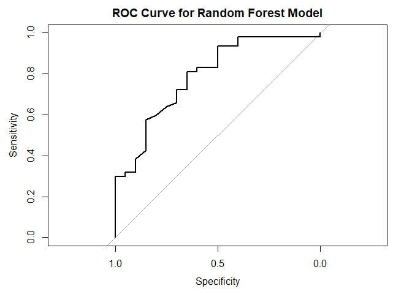

# Load libraries


``` r
library(readr)
library(dplyr)
```

```
## 
## Attache Paket: 'dplyr'
```

```
## Die folgenden Objekte sind maskiert von 'package:stats':
## 
##     filter, lag
```

```
## Die folgenden Objekte sind maskiert von 'package:base':
## 
##     intersect, setdiff, setequal, union
```

``` r
library(ggplot2)
library(caret)
```

```
## Lade nötiges Paket: lattice
```

``` r
library(randomForest)
```

```
## randomForest 4.7-1.1
```

```
## Type rfNews() to see new features/changes/bug fixes.
```

```
## 
## Attache Paket: 'randomForest'
```

```
## Das folgende Objekt ist maskiert 'package:ggplot2':
## 
##     margin
```

```
## Das folgende Objekt ist maskiert 'package:dplyr':
## 
##     combine
```

------------------------------------------------------------------------

# Load the data


``` r
rawData <- read_csv("loan_data.csv")
```

```
## Rows: 381 Columns: 13
## ── Column specification ────────────────────────────────────────────────────────
## Delimiter: ","
## chr (8): Loan_ID, Gender, Married, Dependents, Education, Self_Employed, Pro...
## dbl (5): ApplicantIncome, CoapplicantIncome, LoanAmount, Loan_Amount_Term, C...
## 
## ℹ Use `spec()` to retrieve the full column specification for this data.
## ℹ Specify the column types or set `show_col_types = FALSE` to quiet this message.
```

``` r
# print col names
names(rawData)
```

```
##  [1] "Loan_ID"           "Gender"            "Married"          
##  [4] "Dependents"        "Education"         "Self_Employed"    
##  [7] "ApplicantIncome"   "CoapplicantIncome" "LoanAmount"       
## [10] "Loan_Amount_Term"  "Credit_History"    "Property_Area"    
## [13] "Loan_Status"
```

# Transform the data


``` r
rawData <- read_csv("loan_data.csv")
```

```
## Rows: 381 Columns: 13
## ── Column specification ────────────────────────────────────────────────────────
## Delimiter: ","
## chr (8): Loan_ID, Gender, Married, Dependents, Education, Self_Employed, Pro...
## dbl (5): ApplicantIncome, CoapplicantIncome, LoanAmount, Loan_Amount_Term, C...
## 
## ℹ Use `spec()` to retrieve the full column specification for this data.
## ℹ Specify the column types or set `show_col_types = FALSE` to quiet this message.
```

``` r
# Drop the Loan_ID column
rawData <- rawData %>% select(-Loan_ID)

# Transform categorical variables to factors
rawData <- rawData %>% mutate(
  Married = factor(ifelse(Married == "Yes", TRUE, FALSE)),
  Education = factor(ifelse(Education == "Graduate", TRUE, FALSE)),
  Self_Employed = factor(ifelse(Self_Employed == "Yes", TRUE, FALSE)),
  Gender = factor(Gender),
  Dependents = factor(Dependents),
  Property_Area = factor(Property_Area),
  Loan_Status = factor(Loan_Status)
)

print(rawData)
```

```
## # A tibble: 381 × 12
##    Gender Married Dependents Education Self_Employed ApplicantIncome
##    <fct>  <fct>   <fct>      <fct>     <fct>                   <dbl>
##  1 Male   TRUE    1          TRUE      FALSE                    4583
##  2 Male   TRUE    0          TRUE      TRUE                     3000
##  3 Male   TRUE    0          FALSE     FALSE                    2583
##  4 Male   FALSE   0          TRUE      FALSE                    6000
##  5 Male   TRUE    0          FALSE     FALSE                    2333
##  6 Male   TRUE    2          TRUE      FALSE                    3200
##  7 Male   TRUE    2          TRUE      <NA>                     2500
##  8 Male   FALSE   0          TRUE      FALSE                    1853
##  9 Male   TRUE    2          TRUE      FALSE                    1299
## 10 Male   FALSE   0          TRUE      FALSE                    4950
## # ℹ 371 more rows
## # ℹ 6 more variables: CoapplicantIncome <dbl>, LoanAmount <dbl>,
## #   Loan_Amount_Term <dbl>, Credit_History <dbl>, Property_Area <fct>,
## #   Loan_Status <fct>
```

``` r
# drop all missing values just for testing TODO
rawData <- na.omit(rawData)
```


``` r
# Check for null values and handle them (if any)
null_counts <- colSums(is.na(rawData))
print(null_counts)
```

```
##            Gender           Married        Dependents         Education 
##                 0                 0                 0                 0 
##     Self_Employed   ApplicantIncome CoapplicantIncome        LoanAmount 
##                 0                 0                 0                 0 
##  Loan_Amount_Term    Credit_History     Property_Area       Loan_Status 
##                 0                 0                 0                 0
```

------------------------------------------------------------------------

# Initial Data sighting


``` r
# Plot 1: Distribution of Loan Status with customized colors
ggplot(rawData, aes(x = Loan_Status, fill = Loan_Status)) +
  geom_bar(color = "black") +
  scale_fill_manual(values = c("Y" = "#90EE90", "N" = "#FFB6C1")) +
  theme_minimal() +
  ggtitle("Distribution of Loan Status")
```

<!-- -->


``` r
# Plot 2: Distribution of Gender with customized RGB colors
ggplot(rawData, aes(x = Gender, fill = Gender)) +
  geom_bar(color = "black") +
  scale_fill_manual(values = c("Male" = "#89CFF0", "Female" = "#FFB6C1")) +
  theme_minimal() +
  ggtitle("Distribution of Gender")
```

<!-- -->


``` r
# Plot 3: Average Loan Amount by Property Area
avg_loan_amount <- rawData %>%
  group_by(Property_Area) %>%
  summarise(Average_LoanAmount = mean(LoanAmount, na.rm = TRUE))

ggplot(avg_loan_amount, aes(x = Property_Area, y = Average_LoanAmount, fill = Property_Area)) +
  geom_bar(stat = "identity", color = "black") +
  theme_minimal() +
  ggtitle("Average Loan Amount by Property Area") +
  labs(y = "Average Loan Amount", fill = "Property Area")
```

<!-- -->


``` r
# Plot 4: Distribution of Loan Status by Education
ggplot(rawData, aes(x = Loan_Status, fill = Education)) +
  geom_bar(position = "dodge", color = "black") +
  theme_minimal() +
  ggtitle("Distribution of Loan Status by Education") +
  labs(fill = "Education")
```

<!-- -->


``` r
# Plot 5: Distribution of Loan Status by Self Employed status
ggplot(rawData, aes(x = Loan_Status, fill = Self_Employed)) +
  geom_bar(position = "dodge", color = "black") +
  theme_minimal() +
  ggtitle("Distribution of Loan Status by Self Employed Status") +
  labs(fill = "Self Employed")
```

<!-- -->


# Split Data into Training and Testing Sets

``` r
set.seed(123)  # For reproducibility

# Split the data into training (80%) and testing (20%) sets
trainIndex <- createDataPartition(rawData$Loan_Status, p = .8, 
                                  list = FALSE, 
                                  times = 1)
trainData <- rawData[ trainIndex,]
testData  <- rawData[-trainIndex,]
```

# Train the Random Forest Model

``` r
# Train the model
rf_model <- randomForest(Loan_Status ~ ., data = trainData, importance = TRUE, ntree = 500)

# Print the model
print(rf_model)
```

```
## 
## Call:
##  randomForest(formula = Loan_Status ~ ., data = trainData, importance = TRUE,      ntree = 500) 
##                Type of random forest: classification
##                      Number of trees: 500
## No. of variables tried at each split: 3
## 
##         OOB estimate of  error rate: 17.74%
## Confusion matrix:
##    N   Y class.error
## N 36  36  0.50000000
## Y  8 168  0.04545455
```

``` r
# Check the importance of variables
importance(rf_model)
```

```
##                            N          Y MeanDecreaseAccuracy MeanDecreaseGini
## Gender             0.8473761  0.4201563           0.93583738         2.014488
## Married           -3.4872475  3.2921125           0.76407064         2.760396
## Dependents        -2.5633966 -1.1043048          -2.37864083         4.342131
## Education         -0.4572081 -2.8615318          -2.47574251         2.199233
## Self_Employed     -3.4511021  2.3250787           0.08867498         1.297358
## ApplicantIncome   -1.2311767  8.7845691           7.45249029        18.305400
## CoapplicantIncome  5.2533346  7.5959685           9.11948000        11.287346
## LoanAmount         1.1711290  1.2615054           1.67518193        15.793777
## Loan_Amount_Term   1.5666382  4.9600125           4.76955339         5.099701
## Credit_History    46.7925910 45.2840544          51.68754084        26.601415
## Property_Area      0.4185772  0.1613085           0.37490630         5.520060
```

# Evaluate the Model

``` r
# Predict on the test data
predictions <- predict(rf_model, newdata = testData)

# Confusion matrix
confusionMatrix(predictions, testData$Loan_Status)
```

```
## Confusion Matrix and Statistics
## 
##           Reference
## Prediction  N  Y
##          N 10  1
##          Y  7 42
##                                           
##                Accuracy : 0.8667          
##                  95% CI : (0.7541, 0.9406)
##     No Information Rate : 0.7167          
##     P-Value [Acc > NIR] : 0.004937        
##                                           
##                   Kappa : 0.6325          
##                                           
##  Mcnemar's Test P-Value : 0.077100        
##                                           
##             Sensitivity : 0.5882          
##             Specificity : 0.9767          
##          Pos Pred Value : 0.9091          
##          Neg Pred Value : 0.8571          
##              Prevalence : 0.2833          
##          Detection Rate : 0.1667          
##    Detection Prevalence : 0.1833          
##       Balanced Accuracy : 0.7825          
##                                           
##        'Positive' Class : N               
## 
```

``` r
# Plot ROC curve and calculate AUC
library(pROC)
```

```
## Type 'citation("pROC")' for a citation.
```

```
## 
## Attache Paket: 'pROC'
```

```
## Die folgenden Objekte sind maskiert von 'package:stats':
## 
##     cov, smooth, var
```

``` r
roc_obj <- roc(testData$Loan_Status, as.numeric(predictions))
```

```
## Setting levels: control = N, case = Y
```

```
## Setting direction: controls < cases
```

``` r
auc(roc_obj)
```

```
## Area under the curve: 0.7825
```

``` r
plot(roc_obj, main="ROC Curve for Random Forest Model")
```

<!-- -->

# Visualize Important Variables

``` r
# Plot the importance of variables
varImpPlot(rf_model, main="Variable Importance in Random Forest Model")
```

<!-- -->
