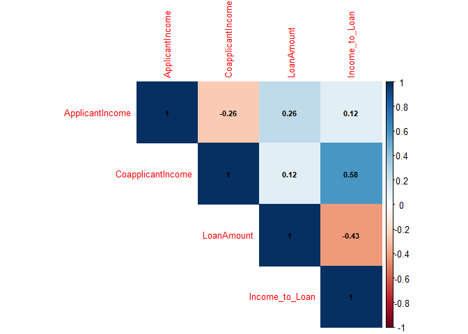

# Load libraries


``` r
library(readr)
library(dplyr)
```

```
## 
## Attache Paket: 'dplyr'
```

```
## Die folgenden Objekte sind maskiert von 'package:stats':
## 
##     filter, lag
```

```
## Die folgenden Objekte sind maskiert von 'package:base':
## 
##     intersect, setdiff, setequal, union
```

``` r
library(ggplot2)
library(caret)
```

```
## Lade nötiges Paket: lattice
```

``` r
library(randomForest)
```

```
## randomForest 4.7-1.1
```

```
## Type rfNews() to see new features/changes/bug fixes.
```

```
## 
## Attache Paket: 'randomForest'
```

```
## Das folgende Objekt ist maskiert 'package:ggplot2':
## 
##     margin
```

```
## Das folgende Objekt ist maskiert 'package:dplyr':
## 
##     combine
```

``` r
library(pROC)
```

```
## Type 'citation("pROC")' for a citation.
```

```
## 
## Attache Paket: 'pROC'
```

```
## Die folgenden Objekte sind maskiert von 'package:stats':
## 
##     cov, smooth, var
```

``` r
library(class)
library(rpart)
```

------------------------------------------------------------------------

# Load the data


``` r
rawData <- read_csv("loan_data.csv")
```

```
## Rows: 381 Columns: 13
## ── Column specification ────────────────────────────────────────────────────────
## Delimiter: ","
## chr (8): Loan_ID, Gender, Married, Dependents, Education, Self_Employed, Pro...
## dbl (5): ApplicantIncome, CoapplicantIncome, LoanAmount, Loan_Amount_Term, C...
## 
## ℹ Use `spec()` to retrieve the full column specification for this data.
## ℹ Specify the column types or set `show_col_types = FALSE` to quiet this message.
```

``` r
# print col names
names(rawData)
```

```
##  [1] "Loan_ID"           "Gender"            "Married"          
##  [4] "Dependents"        "Education"         "Self_Employed"    
##  [7] "ApplicantIncome"   "CoapplicantIncome" "LoanAmount"       
## [10] "Loan_Amount_Term"  "Credit_History"    "Property_Area"    
## [13] "Loan_Status"
```

# Transform the data


``` r
rawData <- read_csv("loan_data.csv")
```

```
## Rows: 381 Columns: 13
## ── Column specification ────────────────────────────────────────────────────────
## Delimiter: ","
## chr (8): Loan_ID, Gender, Married, Dependents, Education, Self_Employed, Pro...
## dbl (5): ApplicantIncome, CoapplicantIncome, LoanAmount, Loan_Amount_Term, C...
## 
## ℹ Use `spec()` to retrieve the full column specification for this data.
## ℹ Specify the column types or set `show_col_types = FALSE` to quiet this message.
```

``` r
# Drop the Loan_ID column
rawData <- rawData %>% select(-Loan_ID)

# Transform categorical variables to factors
rawData <- rawData %>% mutate(
  Married = factor(ifelse(Married == "Yes", TRUE, FALSE)),
  Education = factor(ifelse(Education == "Graduate", TRUE, FALSE)),
  Self_Employed = factor(ifelse(Self_Employed == "Yes", TRUE, FALSE)),
  Gender = factor(Gender),
  Dependents = factor(Dependents),
  Property_Area = factor(Property_Area),
  Loan_Status = factor(ifelse(Loan_Status == "Y", TRUE, FALSE))
)

print(rawData)
```

```
## # A tibble: 381 × 12
##    Gender Married Dependents Education Self_Employed ApplicantIncome
##    <fct>  <fct>   <fct>      <fct>     <fct>                   <dbl>
##  1 Male   TRUE    1          TRUE      FALSE                    4583
##  2 Male   TRUE    0          TRUE      TRUE                     3000
##  3 Male   TRUE    0          FALSE     FALSE                    2583
##  4 Male   FALSE   0          TRUE      FALSE                    6000
##  5 Male   TRUE    0          FALSE     FALSE                    2333
##  6 Male   TRUE    2          TRUE      FALSE                    3200
##  7 Male   TRUE    2          TRUE      <NA>                     2500
##  8 Male   FALSE   0          TRUE      FALSE                    1853
##  9 Male   TRUE    2          TRUE      FALSE                    1299
## 10 Male   FALSE   0          TRUE      FALSE                    4950
## # ℹ 371 more rows
## # ℹ 6 more variables: CoapplicantIncome <dbl>, LoanAmount <dbl>,
## #   Loan_Amount_Term <dbl>, Credit_History <dbl>, Property_Area <fct>,
## #   Loan_Status <fct>
```


``` r
# drop all missing values just for testing TODO
rawData <- na.omit(rawData)
```


``` r
# Check for null values and handle them (if any)
null_counts <- colSums(is.na(rawData))
print(null_counts)
```

```
##            Gender           Married        Dependents         Education 
##                 0                 0                 0                 0 
##     Self_Employed   ApplicantIncome CoapplicantIncome        LoanAmount 
##                 0                 0                 0                 0 
##  Loan_Amount_Term    Credit_History     Property_Area       Loan_Status 
##                 0                 0                 0                 0
```


``` r
# save the data as a csv #TODO
write.csv(rawData, "C:/Users/timst/Documents/GitHub/E-Business-Loan-Status-Prediction/rawData.csv")
```

------------------------------------------------------------------------

# Initial Data sighting


``` r
# Plot 1: Distribution of Loan Status with customized colors
ggplot(rawData, aes(x = Loan_Status, fill = Loan_Status)) +
  geom_bar(color = "black") +
  scale_fill_manual(values = c("TRUE" = "#90EE90", "FALSE" = "#FFB6C1")) +
  theme_minimal() +
  ggtitle("Distribution of Loan Status")
```

<!-- -->


``` r
# Plot 2: Distribution of Gender with customized RGB colors
ggplot(rawData, aes(x = Gender, fill = Gender)) +
  geom_bar(color = "black") +
  scale_fill_manual(values = c("Male" = "#89CFF0", "Female" = "#FFB6C1")) +
  theme_minimal() +
  ggtitle("Distribution of Gender")
```

<!-- -->


``` r
# Plot 3: Average Loan Amount by Property Area
avg_loan_amount <- rawData %>%
  group_by(Property_Area) %>%
  summarise(Average_LoanAmount = mean(LoanAmount, na.rm = TRUE))

ggplot(avg_loan_amount, aes(x = Property_Area, y = Average_LoanAmount, fill = Property_Area)) +
  geom_bar(stat = "identity", color = "black") +
  theme_minimal() +
  ggtitle("Average Loan Amount by Property Area") +
  labs(y = "Average Loan Amount", fill = "Property Area")
```

<!-- -->


``` r
# Plot 4: Distribution of Loan Status by Education
ggplot(rawData, aes(x = Loan_Status, fill = Education)) +
  geom_bar(position = "dodge", color = "black") +
  theme_minimal() +
  ggtitle("Distribution of Loan Status by Education") +
  labs(fill = "Education")
```

<!-- -->


``` r
# Plot 5: Distribution of Loan Status by Self Employed status
ggplot(rawData, aes(x = Loan_Status, fill = Self_Employed)) +
  geom_bar(position = "dodge", color = "black") +
  theme_minimal() +
  ggtitle("Distribution of Loan Status by Self Employed Status") +
  labs(fill = "Self Employed")
```

<!-- -->

# Split Data into Training and Testing Sets


``` r
set.seed(123)  # For reproducibility

# Split the data into training (80%) and testing (20%) sets
trainIndex <- createDataPartition(rawData$Loan_Status, p = .8, 
                                  list = FALSE, 
                                  times = 1)
trainData <- rawData[ trainIndex,]
testData  <- rawData[-trainIndex,]
```

# Scale the Data


``` r
# Identify numeric columns
numeric_cols <- sapply(trainData, is.numeric)

# Apply scaling and centering to numeric columns
preProc <- preProcess(trainData[, numeric_cols], method = c("center", "scale"))
trainData[, numeric_cols] <- predict(preProc, trainData[, numeric_cols])
testData[, numeric_cols] <- predict(preProc, testData[, numeric_cols])

print(head(trainData))
```

```
## # A tibble: 6 × 12
##   Gender Married Dependents Education Self_Employed ApplicantIncome
##   <fct>  <fct>   <fct>      <fct>     <fct>                   <dbl>
## 1 Male   TRUE    0          TRUE      TRUE                   -0.400
## 2 Male   TRUE    0          FALSE     FALSE                  -0.838
## 3 Male   TRUE    2          TRUE      FALSE                  -0.269
## 4 Male   FALSE   0          TRUE      FALSE                  -1.15 
## 5 Male   TRUE    2          TRUE      FALSE                  -1.52 
## 6 Male   FALSE   0          TRUE      FALSE                   0.880
## # ℹ 6 more variables: CoapplicantIncome <dbl>, LoanAmount <dbl>,
## #   Loan_Amount_Term <dbl>, Credit_History <dbl>, Property_Area <fct>,
## #   Loan_Status <fct>
```

``` r
print(head(testData))
```

```
## # A tibble: 6 × 12
##   Gender Married Dependents Education Self_Employed ApplicantIncome
##   <fct>  <fct>   <fct>      <fct>     <fct>                   <dbl>
## 1 Male   TRUE    1          TRUE      FALSE                  0.639 
## 2 Male   TRUE    0          FALSE     FALSE                 -0.674 
## 3 Male   FALSE   0          TRUE      FALSE                  1.57  
## 4 Male   FALSE   0          FALSE     FALSE                  0.0909
## 5 Male   FALSE   0          TRUE      FALSE                 -1.19  
## 6 Male   TRUE    1          TRUE      FALSE                  1.34  
## # ℹ 6 more variables: CoapplicantIncome <dbl>, LoanAmount <dbl>,
## #   Loan_Amount_Term <dbl>, Credit_History <dbl>, Property_Area <fct>,
## #   Loan_Status <fct>
```

# Train and Evaluate the Random Forest Model


``` r
# Train the model
rf_model <- randomForest(Loan_Status ~ ., data = trainData, importance = TRUE, ntree = 500)

# Predict on the test data
rf_predictions <- predict(rf_model, newdata = testData)

# Confusion matrix
rf_conf_matrix <- confusionMatrix(rf_predictions, testData$Loan_Status)
print(rf_conf_matrix)
```

```
## Confusion Matrix and Statistics
## 
##           Reference
## Prediction FALSE TRUE
##      FALSE    10    1
##      TRUE      7   42
##                                           
##                Accuracy : 0.8667          
##                  95% CI : (0.7541, 0.9406)
##     No Information Rate : 0.7167          
##     P-Value [Acc > NIR] : 0.004937        
##                                           
##                   Kappa : 0.6325          
##                                           
##  Mcnemar's Test P-Value : 0.077100        
##                                           
##             Sensitivity : 0.5882          
##             Specificity : 0.9767          
##          Pos Pred Value : 0.9091          
##          Neg Pred Value : 0.8571          
##              Prevalence : 0.2833          
##          Detection Rate : 0.1667          
##    Detection Prevalence : 0.1833          
##       Balanced Accuracy : 0.7825          
##                                           
##        'Positive' Class : FALSE           
## 
```

``` r
# Plot ROC curve and calculate AUC
rf_roc_obj <- roc(testData$Loan_Status, as.numeric(rf_predictions))
```

```
## Setting levels: control = FALSE, case = TRUE
```

```
## Setting direction: controls < cases
```

``` r
rf_auc <- auc(rf_roc_obj)
plot(rf_roc_obj, main="ROC Curve for Random Forest Model")
```

<!-- -->

``` r
rf_metrics <- list(Accuracy = rf_conf_matrix$overall['Accuracy'], AUC = rf_auc)
print(rf_metrics)
```

```
## $Accuracy
##  Accuracy 
## 0.8666667 
## 
## $AUC
## Area under the curve: 0.7825
```

# Train and Evaluate the KNN Model


``` r
# Ensure that KNN uses numeric features only
train_knn <- trainData[, numeric_cols]
test_knn <- testData[, numeric_cols]

# Train the KNN model (k = 5)
knn_predictions <- knn(train = train_knn, test = test_knn, cl = trainData$Loan_Status, k = 5)

# Confusion matrix
knn_conf_matrix <- confusionMatrix(knn_predictions, testData$Loan_Status)
print(knn_conf_matrix)
```

```
## Confusion Matrix and Statistics
## 
##           Reference
## Prediction FALSE TRUE
##      FALSE    10    1
##      TRUE      7   42
##                                           
##                Accuracy : 0.8667          
##                  95% CI : (0.7541, 0.9406)
##     No Information Rate : 0.7167          
##     P-Value [Acc > NIR] : 0.004937        
##                                           
##                   Kappa : 0.6325          
##                                           
##  Mcnemar's Test P-Value : 0.077100        
##                                           
##             Sensitivity : 0.5882          
##             Specificity : 0.9767          
##          Pos Pred Value : 0.9091          
##          Neg Pred Value : 0.8571          
##              Prevalence : 0.2833          
##          Detection Rate : 0.1667          
##    Detection Prevalence : 0.1833          
##       Balanced Accuracy : 0.7825          
##                                           
##        'Positive' Class : FALSE           
## 
```

``` r
# Plot ROC curve and calculate AUC
knn_roc_obj <- roc(testData$Loan_Status, as.numeric(knn_predictions))
```

```
## Setting levels: control = FALSE, case = TRUE
```

```
## Setting direction: controls < cases
```

``` r
knn_auc <- auc(knn_roc_obj)
plot(knn_roc_obj, main="ROC Curve for KNN Model")
```

<!-- -->

``` r
knn_metrics <- list(Accuracy = knn_conf_matrix$overall['Accuracy'], AUC = knn_auc)
print(knn_metrics)
```

```
## $Accuracy
##  Accuracy 
## 0.8666667 
## 
## $AUC
## Area under the curve: 0.7825
```

# Train and Evaluate the Decision Tree Model


``` r
# Train the decision tree model
dt_model <- rpart(Loan_Status ~ ., data = trainData, method = "class")

# Predict on the test data
dt_predictions <- predict(dt_model, newdata = testData, type = "class")

# Confusion matrix
dt_conf_matrix <- confusionMatrix(dt_predictions, testData$Loan_Status)
print(dt_conf_matrix)
```

```
## Confusion Matrix and Statistics
## 
##           Reference
## Prediction FALSE TRUE
##      FALSE     9    1
##      TRUE      8   42
##                                          
##                Accuracy : 0.85           
##                  95% CI : (0.7343, 0.929)
##     No Information Rate : 0.7167         
##     P-Value [Acc > NIR] : 0.01221        
##                                          
##                   Kappa : 0.5781         
##                                          
##  Mcnemar's Test P-Value : 0.04550        
##                                          
##             Sensitivity : 0.5294         
##             Specificity : 0.9767         
##          Pos Pred Value : 0.9000         
##          Neg Pred Value : 0.8400         
##              Prevalence : 0.2833         
##          Detection Rate : 0.1500         
##    Detection Prevalence : 0.1667         
##       Balanced Accuracy : 0.7531         
##                                          
##        'Positive' Class : FALSE          
## 
```

``` r
# Plot ROC curve and calculate AUC
dt_roc_obj <- roc(testData$Loan_Status, as.numeric(dt_predictions))
```

```
## Setting levels: control = FALSE, case = TRUE
```

```
## Setting direction: controls < cases
```

``` r
dt_auc <- auc(dt_roc_obj)
plot(dt_roc_obj, main="ROC Curve for Decision Tree Model")
```

<!-- -->

``` r
dt_metrics <- list(Accuracy = dt_conf_matrix$overall['Accuracy'], AUC = dt_auc)
print(dt_metrics)
```

```
## $Accuracy
## Accuracy 
##     0.85 
## 
## $AUC
## Area under the curve: 0.7531
```

# Compare Models


``` r
# Combine metrics into a data frame
model_comparison <- data.frame(
  Model = c("Random Forest", "KNN", "Decision Tree"),
  Accuracy = c(rf_metrics$Accuracy, knn_metrics$Accuracy, dt_metrics$Accuracy),
  AUC = c(rf_metrics$AUC, knn_metrics$AUC, dt_metrics$AUC)
)

print(model_comparison)
```

```
##           Model  Accuracy       AUC
## 1 Random Forest 0.8666667 0.7824897
## 2           KNN 0.8666667 0.7824897
## 3 Decision Tree 0.8500000 0.7530780
```

``` r
# Identify the best model
best_model_name <- model_comparison$Model[which.max(model_comparison$AUC)]
cat("Best model based on AUC is:", best_model_name, "\n")
```

```
## Best model based on AUC is: Random Forest
```

``` r
best_model <- switch(best_model_name,
                     "Random Forest" = rf_model,
                     "KNN" = knn_predictions,
                     "Decision Tree" = dt_model)

# Perform further analysis with the best model (if applicable)
if (best_model_name == "Random Forest") {
  # Plot the importance of variables
  varImpPlot(best_model, main="Variable Importance in Random Forest Model")
} else if (best_model_name == "Decision Tree") {
  # Plot the decision tree
  rpart.plot(best_model, main="Decision Tree for Loan Status Prediction")
}
```

<!-- -->
